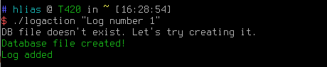
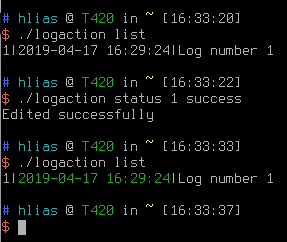

# logaction
Personal log utility.

## Requirements
1) **sqlite3**
## Install
1) Clone this repository `git clone https://github.com/hliasa/logaction`
2) Run `cmake` & then `make`
3) Run `./logaction`
## Usage
```
Usage:
        logaction <command> <parameters>
        logaction "log message"
command list:
        add "log message"
        list <number of last logs>
        edit <log id> <log message>
        status <log id> <fail/success/default>
        del <log id>
```
## Screenshots

